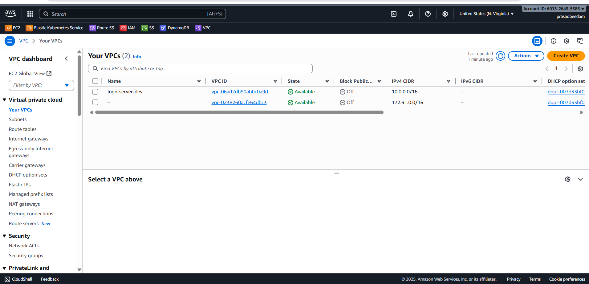
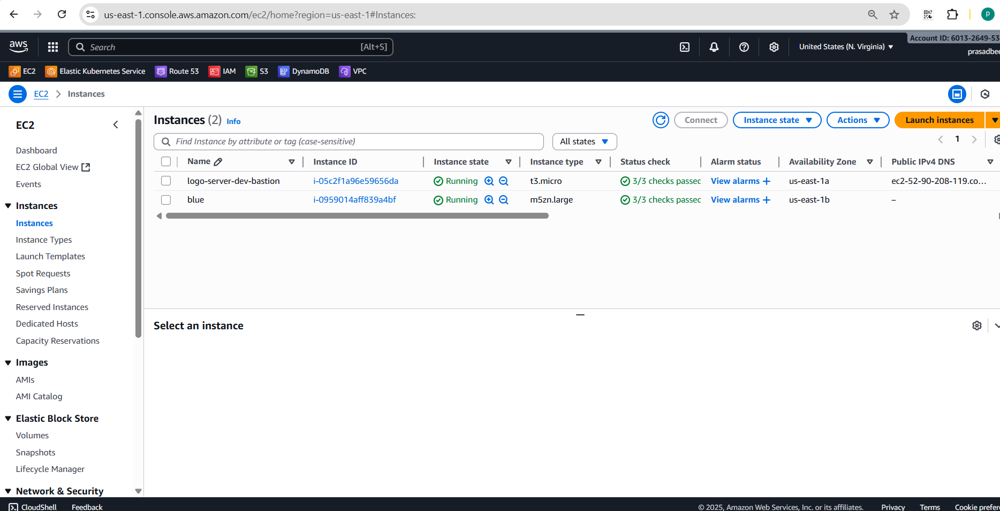
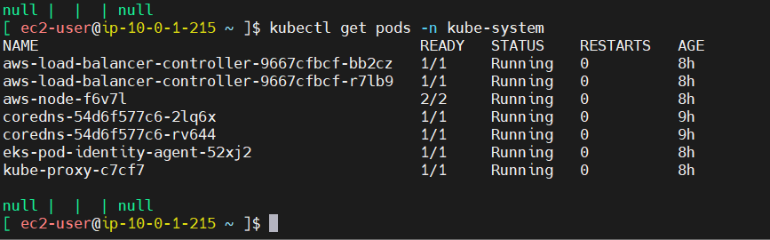
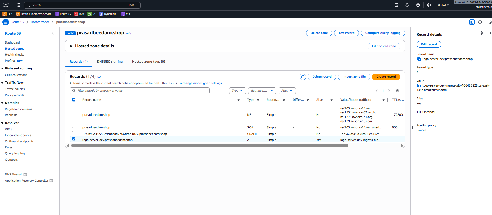
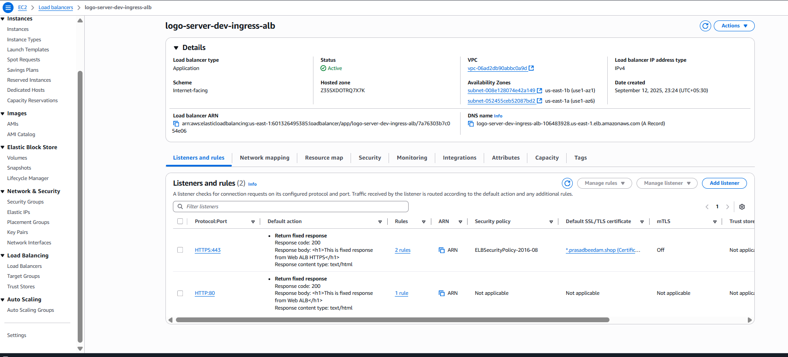
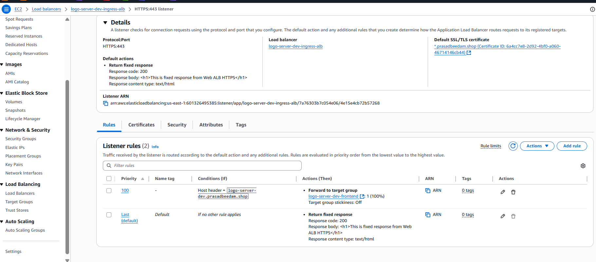
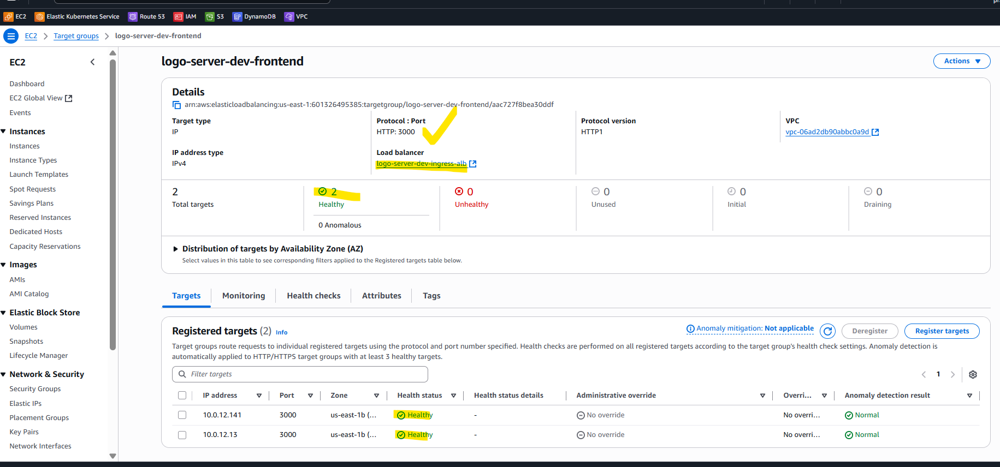
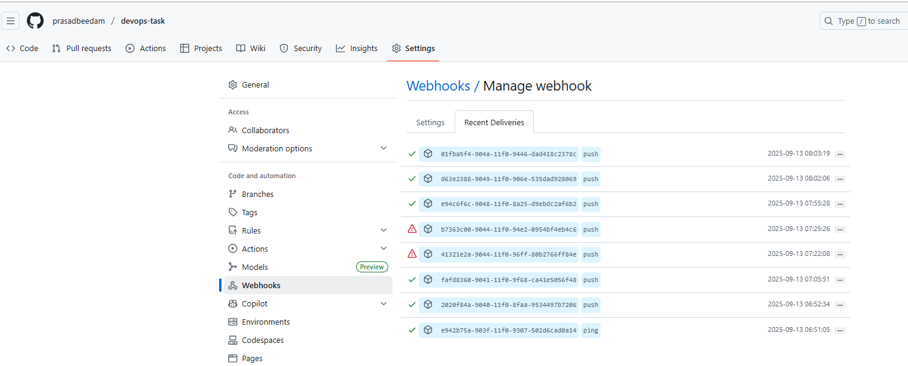
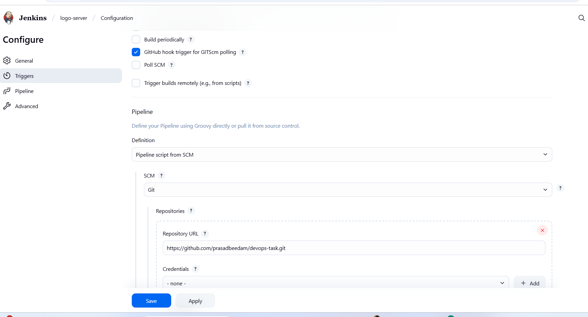
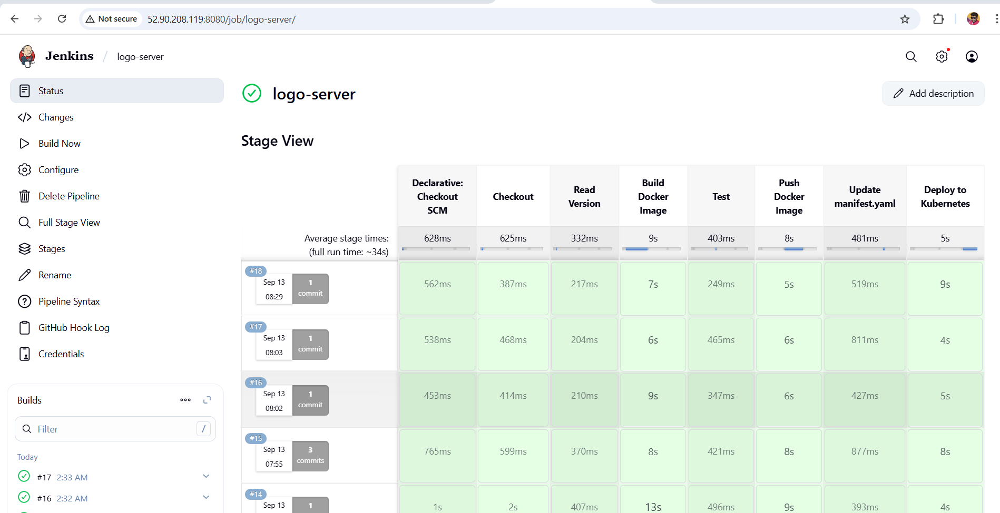

Frist i created infrastructure (You can find in infra path)





```
after infra creation 
```

### Admin activities

**Bastion**
* SSH to bastion host
* run below command and configure the credentials.
```
aws configure
```
* get the kubernetes config using below command
```
aws eks update-kubeconfig --region us-east-1 --name <YOUR-CLUSTER-NAME>
```
* Now you should be able to connect K8 cluster
```
kubectl get nodes
```

**Ingress Controller**

Ref: https://kubernetes-sigs.github.io/aws-load-balancer-controller/v2.8/
* Connect to K8 cluster from bastion host.
* Create an IAM OIDC provider. You can skip this step if you already have one for your cluster.
```
eksctl utils associate-iam-oidc-provider --region us-east-1 --cluster <your-cluster-name> --approve
```
* Download an IAM policy for the LBC using one of the following commands:
```
curl -o iam-policy.json https://raw.githubusercontent.com/kubernetes-sigs aws-load-balancer-controller/v2.8.1/docs/install/iam_policy.json
```

* Create an IAM policy named AWSLoadBalancerControllerIAMPolicy. If you downloaded a different policy, replace iam-policy with the name of the policy that you downloaded.
```
aws iam create-policy --policy-name AWSLoadBalancerControllerIAMPolicy --policy-document file://iam-policy.json
```

* Create a IAM role and ServiceAccount for the AWS Load Balancer controller, use the ARN from the step above

```
eksctl create iamserviceaccount \
--cluster=<cluster-name> \
--namespace=kube-system \
--name=aws-load-balancer-controller \
--attach-policy-arn=arn:aws:iam::<AWS_ACCOUNT_ID>:policy/AWSLoadBalancerControllerIAMPolicy \
--override-existing-serviceaccounts \
--approve
```

* Add the EKS chart repo to Helm
```
helm repo add eks https://aws.github.io/eks-charts
```

* Helm install command for clusters with IRSA:

```
helm install aws-load-balancer-controller eks/aws-load-balancer-controller -n kube-system --set clusterName=<cluster-name> --set serviceAccount.create=false --set serviceAccount.name=aws-load-balancer-controller
```

* check aws-load-balancer-controller is running in kube-system namespace.We should get
```
kubectl get pods -n kube-system
```


```
After This we have created alb rule whenever user hits https://logo-server-dev.prasadbeedam.shop/ traffic send to ingress 

```
User → Domain (Route53) → Ingress Controller → Service → Pod

```










```
then i created Manifestfile

```
Next I ran Jenkins file and configured webhooks
```



```
when ever code push to the branch pipeline will trigger

```
Pipeline
```






```
Result
```

Result.png


